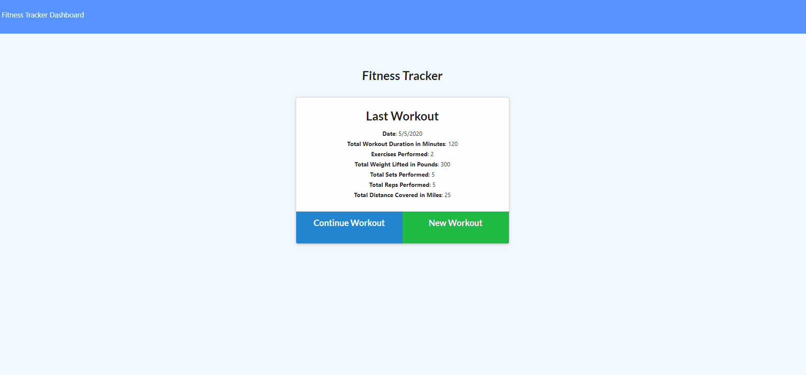
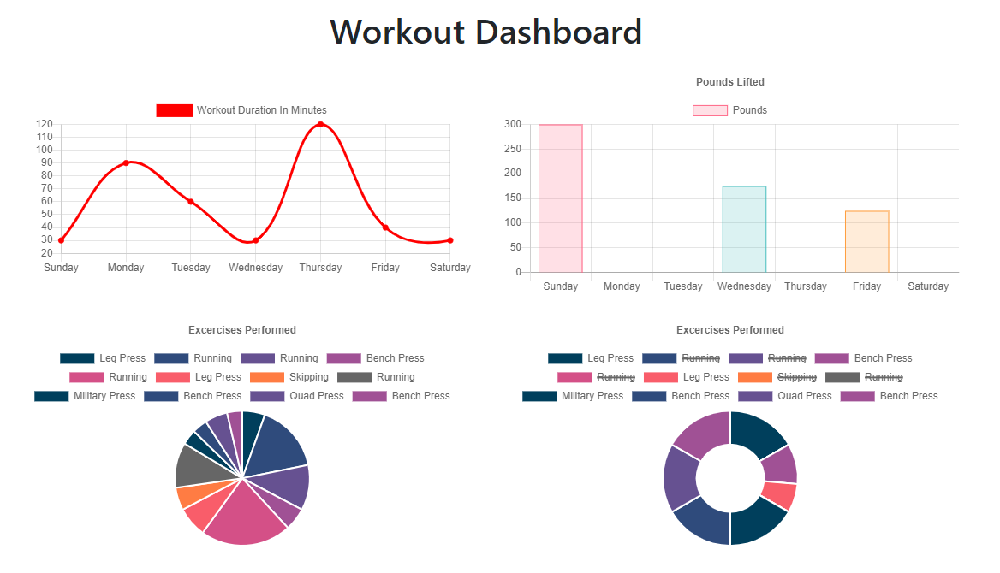
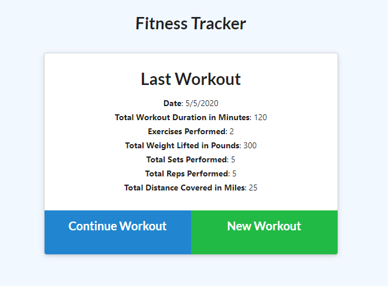

# WorkoutTracker
This application will allow a consumer to reach their fitness goals by tracking their workout progress.

## Description
The application tracks the users' workouts by have the user input the name, type, and duration of an exercise. If the type is cardio, distance is measured. If the type is resistance, weight, reps, and sets are measured. The user will also be able view their achieved workout goals in bar graph and pie graph formats. 

### Table of Contents
I. Title
II. Description
III. Table of Contents
IV. Installation
V. Visuals
VI. Usage
VII. License
VIII. Contributing
IX. Test(s)
X. Questions
    
## Installation
The user will need to install express, mongoose, and morgan dependencies to test application locally. Otherwise, just visit the url.

## Visuals

GIF
 

IMAGES
 

## Usage
The application utilizes mongoose to create a Workout model in MongoDB. After the user has submitted the appropriate parameters, a new document is added to the workout collection in the database. 

## License

    
## Contributing
None

## Test(s)
N/A

## Questions
If you have any questions, please feel free to contact me below.

Email: alexjoeldelgado@gmail.com

<a href='https://github.com/alexjoeldelgado'>Github Profile: alexjoeldelgado</a>

